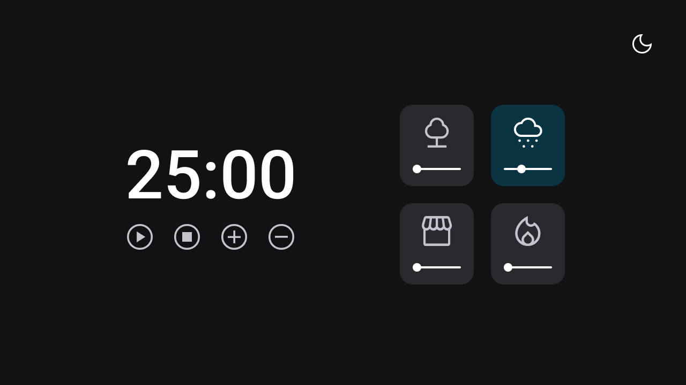

# Focus timer Dark Mode

# Preview

# Instruções:
Funcionalidades esperadas dos botões:

- Play   : aciona o timer;
- Stop   : para o timer;
- + : aumenta em mais 5 minutos o tempo do timer;
- - : diminui em 5 minutos o tempo do timer.

Nessa versão, o volume deverá ser controlado pelo slider que está embaixo de cada ícone.

Versão [um](https://github.com/vivianemartini/FocusTimer2.0)

Obs: por padrão, quando você clicar em qualquer área de um card, você pode deixar o volume em 50%.

# Melhorias

Animações incluidas
 - Zoom
 - Shake

Icons from FontAwesome

# License

This project is licensed under the MIT License - see the LICENSE.md file for details
